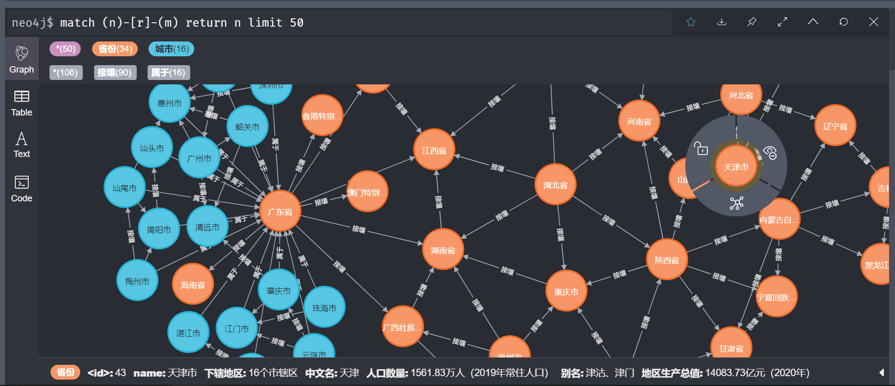

[TOC]

# “小德”：基于知识图谱的城市知识问答系统 / Xiaode: A City KBQA System

从无到有搭建一个包含国家级，省级，地级行政单位属性及其之间关系的知识图谱，并基于该知识图谱完成可带语音接口的问答任务。另外，将西安电子科技大学人工智能学院相关知识入到了知识图谱和问答系统。

## 项目介绍

#### 项目简介

本项目包含以下两部分内容：

1. 基于百度百科网站数据的城市知识图谱构建
2. 基于城市知识图谱的问答系统

#### 技术路线

##### 知识图谱构建

- 数据获取：使用爬虫从百度百科中爬取省级，地级行政区的知识，以及省市间的隶属和接壤关系，解析后，构建json文件

- 数据清洗：清洗数据，去除脏数据，保留资料较为全面的属性，生成后续问答所需文件

- 图谱构建：初始化neo4j图数据库，使用py2neo库和Cypher图数据库查询语言构建图数据库

##### 知识图谱问答

- 命名实体识别和关系映射：首先构建实体的AC自动机，当用户输入时，快速匹配实体。如果匹配到多个实体，则根据语义混合相似度计算找到最相似的实体。如果未匹配到实体，则对问句分词，去除停用词后，将剩余实体与词典中的实体一一进行语义混合相似度的计算，返回最相似的匹配结果。
- 根据实体和关系，生成相应数据库查询语句，得到相应回答。


#### 脚本目录

##### 文件夹

1. data文件夹：存储知识数据，其中origin为原始数据，total为构建知识图谱的中间数据，final为知识问答所需要的数据，added_knowledge为新添加的人工智能学院知识

2. QAcache文件夹：存储语音交互过程中的缓存文件，无需改动

3. source文件夹：存储图形界面的相关组件，无需改动


1. request_data.py：从百度百科中请求数据并解析，构建json格式的知识
2. clean_data.py：清洗数据，保留出现次数较高的属性
3. build_graph.py：从清洗后的json知识中创建图数据
4. data_prepare_main.py：数据准备的主函数，包含4~6

##### 自动问答系统

1. question_answering.py：问答引擎
2. chatbot_main.py：问答系统主函数（在此版本不需要）
3. gui_main.py：图形界面问答系统主函数
4. wave_process.py：云语音任务工具箱
5. utis.py：工具箱

#### 知识图谱简介

##### 主要节点

1. 国家：1个
2. 省级行政区：34个
3. 地级行政区：340个
4. 人工智能学院：1个

共计376个节点

##### 关系

1. 接壤关系：省份-省份，城市-城市
2. 从属关系：城市-省份，省份-国家
3. 包括关系：省份-城市，国家-省份

共计1370个关系（接壤只算单向，从属包括只算从属）

##### 节点属性

选择后的属性有：简介、中文名、外文名、别名、行政区划代码、行政区类别、所属地区、地理位置、面积、下辖地区、政府驻地、电话区号、邮政区码、气候条件、人口数量、著名景点、机场、火车站、车牌代码、地区生产总值、方言等

人工智能学院的属性有一级学科、研究方向、执行院长、学硕分数线、专硕分数线、产教融合分数线、北京分数线、天津分数线等。

## 项目运行方式

#### 测试运行环境

1. 操作系统：Windows10
2. Anaconda版本：4.9.2，Python版本：3.8.5
3. Python依赖库：requests bs4 py2neo ahocorasick pyaudio websocket
4. 图数据库Neo4j Community版本：4.2.2
5. 数据库构建和语音交互需要互联网连接

#### 运行方式

1. 安装Anaconda环境和Python解释器

2. 安装依赖包

   ```shell
   pip install -r requirements.txt
   ```

3. 安装Neo4j图数据库，打开服务，记住用户名和密码，并在修改相应文件中写入用户名和密码

4. 再讯飞开放平台申请一个包含流式听写和语音合成的项目，获取APPID和Key，并写入代码中

5. 构建图数据库：

   ```shell
   python data_prepare_main.py
   ```

6. 运行GUI问答系统：

   ```shell
   python gui_main.py
   ```

## 项目最终效果

#### 知识图谱示例



#### 问答引擎示例


#### 问答系统GUI截图


